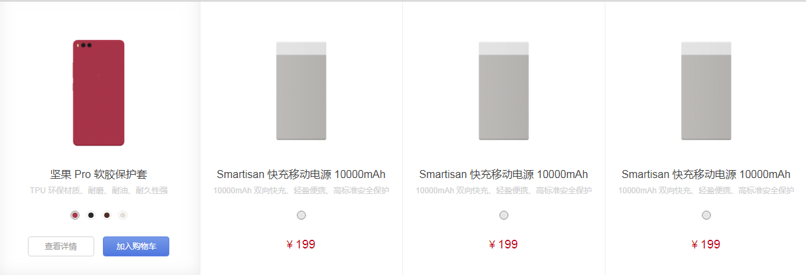

# smartsation

> A vue.js project
> 
### 实例效果图


### 具体模块组件划分

1. 商品列表组件



2. 商品详情组件


3. 购物车清单组件


4. 结算页组件


5. 订单详情组件

6. 订单列表组件


### 技术栈

1. vue基础组件库(上面的所指定的是组件)

2. vue-router(路由):页面的点击跳转

3. vuex(组件集中管理):将我们的数据进行集中管理

4. 插件使用

### 工具 

1. webpack(包管理工具)
2. vue-cli(脚手架:能够快速搭建项目)

### 项目分析

smartation

* build
* config
* node_modules
* src
    * assets
       * css
       * img
       * js
    * components:存放所有的组件(一般放公共组件) 
       * header-nav:头部组件
       * shop-item.vue:单个商品组件
       * car-panel.vue:购物车组件
       * prompt.vue:提示组件
       * footer-nav:页脚组件
       * problem:问题组件
       * concat:联系客服组件
       * selfService:自助服务
       * address-pop:弹出收货新地止组件
       *  

*  static
*  lib:存放我们的模拟数据,因为没有后台,所以模拟数据都放在这里
*  router:配置路由,也就是页面的跳转
*  store:存放我们的vuex的,注意在使用它时,需要先npm安装,使用命令:npm install vuex --save,安装完后,是在package.json里面在dependencies中
    * index.js
*  views:就是存放我们所有的单页面组件
    * Home 首页
    * mPhone我的手机
    * page_one:足迹系列手感膜
    * page_two:周边产品
    * page_three:第三方配件
    * page_four:全部商品
    * page_five:服务 
    * phone手机组件
    * item:商品详情页,点击查看详情时,会跳出
    * cart:购物车清单组件
    * car-panel.vue:
    * checkout.vue:结算页面
    * paymenent:支付页面

## Build Setup

``` bash
# install dependencies
npm install

# serve with hot reload at localhost:8080
npm run dev

# build for production with minification
npm run build

# build for production and view the bundle analyzer report
npm run build --report
```

For a detailed explanation on how things work, check out the [guide](http://vuejs-templates.github.io/webpack/) and [docs for vue-loader](http://vuejs.github.io/vue-loader).
